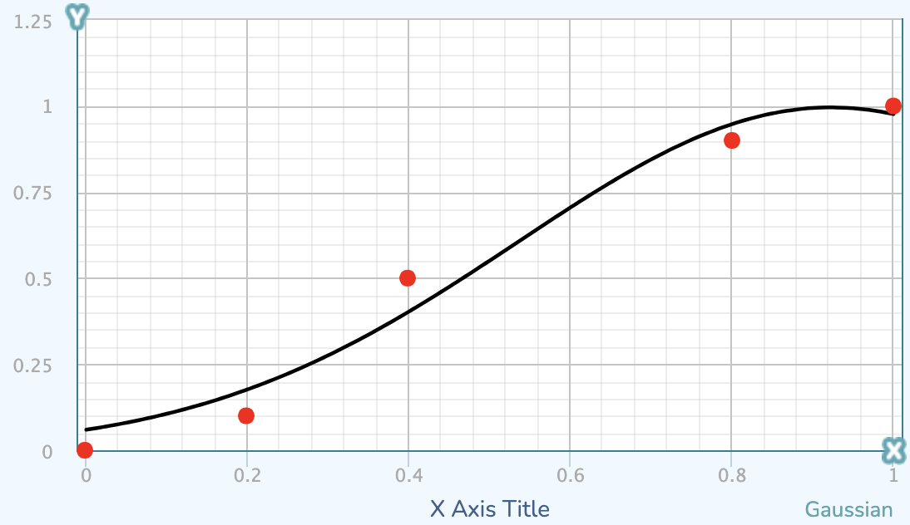

# R2 Software developer home assignment
## How to run
* Install [Docker Desktop](https://www.docker.com/products/docker-desktop/) (which includes `docker` and `docker compose` plugin).
* Clone this project.
* In `Terminal`, navigate to the project's root folder and run this command
  ```sh
  docker compose --project-name r2 up --build
  ```
* Open [`http://localhost:8080`](http://localhost:8080) and try the website.

## Assignment
The assignment is divided into phases, don't be fazed (🥁) if you don't complete all of them, they aren't meant to be completed.  
The website consits of a login page, and a homepage, where in the homepage you can win a prize.  
You'll be completing the `backend` side of this project, since the website is already built.

### Phase 1
* Add a real backend instead of the `be-demo` (which runs using `nginx`), use whatever high-level programming language (garbage collected memory) as you'd like, such as `Node.js`, `Python`, `C#` and etc.  
Call it `be-high-level`.
* Whatever programming language you chose, connect the backend to the rest of the app by creating a `Docker` image of that backend, and make the necessary changes to the `docker compose` so they will work together.  
* The backend should implment a rest-api that has 3 endpoints:
    * `/api/login`  
    Example request body:  
    `{ "email": "a@gmail.com", "password": "1234" }`  
    Example response:  
    `{ "token": "MOCK_TOKEN" }`  
    This route should be accessed by `POST` Method.  
    If the email is not valid or the password is different then `"r2isthebest"` then reject the login.  
    If logins correctly, generate a random `token` and store it memory indefinitely for later validation.  
    * `/api/logout`  
    No request body.  
    Request headers:  
    `"Authorization"`: `"Bearer MOCK_TOKEN"`  
    Example response:  
    `"OK"`  
    This route should be accessed by `POST` Method.  
    If the token is not valid, means it's not stored in memory, reject the response with proper status code and error.  
    If token is valid, remove it from memory.  
    * `/api/try_luck`  
    No request body.  
    Request headers:  
    `"Authorization"`: `"Bearer MOCK_TOKEN"`  
    Example response:  
    `{ "win": true }`  
    This route should be accessed by `POST` Method.  
    If the token is not valid, means it's not stored in memory, reject the response with proper status code and error.  
    If token is valid, calculate whatever the user won or lost (next bullet point) and store in memory whatever won or lost.  
* Win calculation  
  Let's introduce some inputs:
    * `w` - number of wins that day.
    * `l` - number of loses that day.  

  And some variables
    * `t` - total games that day - `w + l`.  
    * `f` - random factor, number between 0 and 1.  
  
  Then `should_win = f > (0.9958498*e^(-(((w+1)/(t+2)) - 0.9227619)^2/(2*0.3887698^2)))`  
  #### Explanation:  
  The formula for `y = 0.9958498*e^(-(x - 0.9227619)^2/(2*0.3887698^2))` is a gaussian that looks like this
    
  For `x` we enter `w+1/t+2`, which is the current win ratio (`+1` to handle zeros),  
  and for `y`, a number between 0 and 1, we compare that to `f` - also a number between 0 and 1 to decide whatever the user won or lost.  
  Using that formula we can assure the win rate will most likely remain around `0.4`. 
* Running the [docker command](#how-to-run) should make your project run, make sure all changes are committed to your `master` branch.


### Phase 2
* Make a branch called `low-level`, and make sure all changes from this phase are commited to that branch.
* Repeat phase 1, but use whatever low-level programming language (manual memory management) as you'd like, such as `Rust`, `Zig`, `C`, `C++` and etc.  
Call it `be-low-level`.

### Phase 3
* Make as many of improvments as you'd like from this list (or other we didn't think of), with the only rule that when we run the code, we shouldn't install/run anything other then what stated in [how to run section](#how-to-run):  
  * Add a DB to manage users and log wins.  
  * Change API to use `swagger` or something else entirely.  
  * Add CI that checks formatting, linting, typing, tests using `github-actions` or something else.
  * Improve `Dockerfile` to use `multistage builds`.  
  * Use `cache layer` such as `redis` to store and update wins and loses.  

